## Section 1 — ERD

```mermaid
erDiagram
    %% ============================================================
    %% Volume 1: Security & Users
    %% ============================================================
    users ||--|| user_credentials : "has security hash (1:1)"
    users {
        varchar32 user_id PK
        varchar50 username UK
        varchar100 email UK
        varchar100 full_name
        date date_of_birth
        varchar20 phone
        varchar255 secret_question
        timestamp registered_at
        boolean is_active
    }
    user_credentials {
        varchar32 user_id PK, FK
        text password_hash
        text secret_answer_hash
    }

    %% ============================================================
    %% Volume 5: Stations & Topology
    %% ============================================================
    metro_stations ||--o{ station_adjacencies : "acts as source/adjacent"
    national_rail_stations ||--o{ station_adjacencies : "acts as source/adjacent"
    
    metro_stations {
        varchar32 station_id PK
        varchar100 name
        varchar255 lines
        boolean is_interchange_metro
        varchar255 interchange_metro_lines
        boolean is_interchange_national_rail
        varchar32 interchange_national_rail_station_id
    }
    national_rail_stations {
        varchar32 station_id PK
        varchar100 name
        varchar255 lines
        boolean is_interchange_national_rail
        varchar255 interchange_national_rail_lines
        boolean is_interchange_metro
        varchar32 interchange_metro_station_id
    }
    station_adjacencies {
        varchar32 source_station_id PK
        varchar32 adjacent_station_id PK
        varchar20 network_type PK
        varchar50 line
        int travel_time_min
    }

    %% ============================================================
    %% Volume 7: Refund Policies
    %% ============================================================
    refund_policies ||--o{ refund_cancellation_windows : "defines tiers"
    refund_policies ||--o{ refund_compensation_rules : "defines triggers"
    refund_policies ||--o{ schedules : "applies to"

    refund_policies {
        varchar32 policy_id PK
        varchar20 service_type
        varchar100 policy_name
        int no_refund_before_departure_min
        date effective_from
        date effective_until
        timestamp created_at
    }
    refund_cancellation_windows {
        varchar32 window_id PK
        varchar32 policy_id FK
        varchar100 window_label
        decimal hours_before_departure_min
        decimal hours_before_departure_max
        decimal refund_percent
        decimal processing_fee_usd
        int sort_order
    }
    refund_compensation_rules {
        varchar32 compensation_id PK
        varchar32 policy_id FK
        varchar30 trigger_type
        int delay_minutes_threshold
        decimal compensation_percent
        varchar20 compensation_type
        text description
    }

    %% ============================================================
    %% Volume 2: Networks & Assets (Normalized with Stop Tables)
    %% ============================================================
    national_rail_stations ||--o{ schedules : "origin"
    national_rail_stations ||--o{ schedules : "destination"
    schedules ||--o{ rail_coaches : "has"
    rail_coaches ||--o{ rail_seats : "contains"

    schedules {
        varchar32 schedule_id PK
        varchar32 route_id
        varchar50 line
        varchar32 policy_id FK
        varchar20 service_type
        varchar20 direction
        time departure_time
        time arrival_time
        varchar32 origin_station_id FK
        varchar32 destination_station_id FK
        decimal base_fare_standard_usd
        decimal per_stop_standard_usd
        decimal base_fare_first_usd
        decimal per_stop_first_usd
        int frequency_min
        varchar100 operates_on
        boolean overnight_flag
    }

    %% Normalized stop sequence table for National Rail schedules
    schedules ||--o{ national_rail_schedule_stops : "has ordered stops"
    national_rail_stations ||--o{ national_rail_schedule_stops : "appears in"

    national_rail_schedule_stops { 
        varchar32 schedule_id PK, FK
        int stop_order PK 
        varchar32 station_id FK 
        int travel_time_offset 
        boolean is_pass_through 
    }


    metro_stations ||--o{ metro_schedules : "origin"
    metro_stations ||--o{ metro_schedules : "destination"
    
    metro_schedules {
        varchar32 metro_schedule_id PK
        varchar50 line
        varchar20 direction
        varchar32 origin_station_id FK
        varchar32 destination_station_id FK
        time first_train_time
        time last_train_time
        int frequency_min
        decimal base_fare_usd
        decimal per_stop_rate_usd
        varchar100 operates_on
    }

    %% Normalized stop sequence table for Metro schedules
    metro_schedules ||--o{ metro_schedule_stops : "has ordered stops" 
    metro_stations ||--o{ metro_schedule_stops : "appears in" 
    
    metro_schedule_stops { 
        varchar32 metro_schedule_id PK, FK 
        int stop_order PK 
        varchar32 station_id FK 
        int travel_time_offset 
    }

    rail_coaches {
        varchar32 coach_id PK
        varchar32 schedule_id FK
        int coach_number
        varchar20 fare_class
    }
    rail_seats {
        varchar64 seat_real_id PK
        varchar32 coach_id FK
        varchar10 seat_id
        int seat_row
        varchar5 seat_column
        boolean is_booked
    }

    %% ============================================================
    %% Volume 6: History, Bookings & Feedback
    %% ============================================================
    users ||--o{ bookings : "places"
    schedules ||--o{ bookings : "reserved for"
    national_rail_stations ||--o{ bookings : "origin"
    national_rail_stations ||--o{ bookings : "destination"
    rail_seats ||--o{ bookings : "assigned"
    bookings ||--o{ feedback : "receives"
    users ||--o{ feedback : "writes"

    bookings {
        varchar32 booking_id PK
        varchar32 user_id FK
        varchar32 schedule_id FK
        varchar32 origin_station_id FK
        varchar32 destination_station_id FK
        date travel_date
        time departure_time
        varchar20 ticket_type
        varchar20 fare_class
        varchar64 seat_real_id FK
        int stops_travelled
        decimal amount_usd
        varchar20 status
        timestamp booked_at
        timestamp travelled_at
    }
    feedback {
        varchar32 feedback_id PK
        varchar32 booking_id FK
        varchar32 user_id FK
        int rating
        text comment
        timestamp submitted_at
    }

    users ||--o{ metro_travel_history : "undertakes"
    metro_schedules ||--o{ metro_travel_history : "referenced in"
    metro_stations ||--o{ metro_travel_history : "origin"
    metro_stations ||--o{ metro_travel_history : "destination"

    metro_travel_history {
        varchar32 trip_id PK
        varchar32 user_id FK
        varchar32 metro_schedule_id FK
        varchar32 origin_station_id FK
        varchar32 destination_station_id FK
        date travel_date
        varchar20 ticket_type
        varchar32 day_pass_ref
        int stops_travelled
        decimal amount_usd
        varchar20 status
        timestamp purchased_at
        timestamp travelled_at
    }

    %% ============================================================
    %% Volume 3 & 4: Payments & Telemetry Logs
    %% ============================================================
    bookings ||--o{ payments : "settles"
    payments ||--o{ payments : "refund parent link (1:N)"

    payments {
        varchar32 payment_id PK
        varchar32 booking_id FK
        decimal amount_usd
        varchar20 payment_type
        varchar30 method
        varchar20 status
        timestamp paid_at
        varchar32 parent_payment_id FK
        decimal refunded_amount
    }

    users ||--o{ metro_access_logs : "generates"
    metro_stations ||--o{ metro_access_logs : "located at"

    metro_access_logs {
        bigint log_id PK
        varchar32 user_id FK
        varchar32 station_id FK
        varchar10 action_type
        timestamp timestamp
        varchar32 day_pass_trip_id
    }

    %% ============================================================
    %% Volume 8 & 9: Business & Legal Rules
    %% ============================================================
    booking_rule_sets ||--o{ booking_rule_params : "contains"
    booking_rule_sets {
        varchar32 rule_set_id PK
        varchar20 network_type
        int version
        boolean is_active
        date effective_from
        date effective_until
        timestamp created_at
    }
    booking_rule_params {
        bigserial param_id PK
        varchar32 rule_set_id FK
        varchar20 ticket_type
        varchar20 fare_class
        varchar100 rule_key
        decimal rule_value_numeric
        varchar255 rule_value_text
        varchar20 unit
        text description
    }

    policy_categories ||--o{ policy_rules : "categorizes"
    policy_categories {
        varchar32 category_id PK
        varchar20 network_type
        varchar100 category_key
        varchar100 display_name_zh
        varchar100 display_name_en
        int sort_order
    }
    policy_rules {
        varchar32 rule_id PK
        varchar32 category_id FK
        varchar100 rule_key
        boolean is_permitted
        varchar500 rule_value_text
        text description_zh
        text description_en
        varchar20 applies_to_ticket_type
        varchar20 applies_to_fare_class
        date effective_from
        date effective_until
        int version
        boolean is_active
        timestamp created_at
        timestamp updated_at
    }

    %% Unconnected Vector Segment (RAG Component)
    policy_documents {
        int id PK
        varchar200 title
        varchar50 category
        text content
        vector embedding
        varchar200 source_file
        timestamptz created_at
    }
```



## Section 2 — Normalisation Justification

### 1. Relational Normalisation Decisions (3NF)

在 TransitFlow 系統的核心關聯式資料庫設計中，特別是班次、車站、停靠順序與交易資料的設計上，本專案以 **Third Normal Form (3NF，第三正規化)** 為主要設計原則，旨在降低資料冗餘（Data Redundancy）、避免結構性的更新異常（Update Anomalies），並維護資料的一致性。

本系統中一項展現 2NF 與 3NF 設計決策的核心實例，在於解決「車站（Stations）」與「營運班次（Schedules）」之間複雜的多對多（M:N）關係，我們藉由導入聯合表（Junction Table）`metro_schedule_stops` 與 `national_rail_schedule_stops` 來進行完美的綱要解耦。

* **Candidate Keys 與 Functional Dependencies（功能相依）之分析**：
  若在未經正規化的不良設計中，開發者可能會試圖將班次與停靠站資訊硬塞在同一張表中。在這種情況下，若以複合鍵 `{schedule_id, station_id}` 作為 Primary Key，非主屬性（如班次所屬的 `line`、票價欄位，或停靠關係中的 `travel_time_offset`）將產生混亂的相依關係。
  
  具體而言：`line` 僅相依於 `schedule_id`，而 `station_name` 僅相依於 `station_id`（這兩者皆為部分相依，違反 2NF）；同時，停靠關係本身的屬性如 `travel_time_offset` 則應嚴格相依於完整的 `{schedule_id, stop_order}` 組合。若強行合併，不僅引發資料重複，一旦車站改名更會造成全表多處的 Update Anomalies。

* **藉由 Junction Table 達成 3NF 合規性**：
  為了解決上述缺陷，本專案的 Schema 實作了完全解耦的 3NF 架構：
  1. 將實體分離：車站基礎屬性存放於 `metro_stations`，班次通用屬性存放於 `metro_schedules`。
  2. 建立中介表：透過 `metro_schedule_stops` 作為聯合表，使用複合主鍵 `{metro_schedule_id, stop_order}` 來記錄特定班次在特定停靠順序上的車站（`station_id`）與相對行車時間（`travel_time_offset`）。

  透過此項設計，所有非鍵屬性（Non-key attributes）皆嚴格相依於「主鍵、完整的主鍵，且僅有主鍵（the key, the whole key, and nothing but the key）」。此決策徹底根絕了 Partial Dependency（部分相依）與 Transitive Dependency（遞移相依），保證了關聯查詢時的結構完整性。

---

### 2. Deliberate De-normalisation Trade-offs

在本系統的架構規劃中，雖然基礎資料維持嚴格的 3NF，但針對核心交易表 `bookings`（訂單），**本專案刻意採用了「歷史快照（Transaction Snapshot）」的設計模式，這是一項經過深思熟慮的有意反正規化（Deliberate De-normalisation）權衡。**

* **審計正確性（Audit Accuracy）與歷史不可變性之權衡論證**：
  在嚴格正規化的設計下，訂單金額與起訖站資訊可以透過 `JOIN` 回 `schedules`、`national_rail_schedule_stops` 與站點資料表，並依照票價欄位（如 `base_fare_standard_usd`、`per_stop_standard_usd`、`base_fare_first_usd` 等）動態重新計算。然而，在大眾運輸與電子商務系統中，票價基準（Base Fare）與車站營運狀態是會隨時間變更的。
  
  如果明天系統調漲了票價，嚴格 3NF 下動態 `JOIN` 算出來的歷史訂單金額將會跟著改變，這將導致災難性的財務帳目不一致與稽核失敗。

* **結論**：
  為了解決此問題，我們在 `bookings` 資料表中，刻意將 `amount_usd`（交易金額）、`departure_time`（出發時間）、`origin_station_id` 等當下狀態，直接作為冗餘欄位存儲下來。
  
  此種反正規化設計將當下的營運狀態「凍結」為歷史快照。同時，我們搭配嚴格的 Foreign Key 約束（例如在訂單關聯 `bookings.user_id` 中採用 `ON DELETE RESTRICT`，嚴禁輕易刪除帶有交易紀錄的使用者，而非危險的 `CASCADE`），確保了金融稽核數據具備絕對的不可篡改性與歷史正確性。這是為了滿足商業金流邏輯而必須且完全合理的 Trade-off。

---

### 3. Cryptographic Password Hashing & Salt Management

為了保障用戶憑證（User Credentials）的隱私安全並防止潛在的資料庫外洩風險，本系統的應用程式層（Application Layer）導入了符合工業級標準的 **Argon2id** 密碼學雜湊演算法，且資料庫的 `user_credentials.password_hash` 欄位結構亦專門設計用於存儲其生成的複雜雜湊值，全面淘汰已被證實具備安全漏洞的傳統基元如 MD5 或 SHA-1。

* **選用 Argon2id 取代替代方案（MD5/SHA-1）之核心理由**：
  MD5 與 SHA-1 本質上屬於追求極致執行效率的通用型密碼學雜湊函數。由於其缺乏內在的計算複雜度約束，一旦系統資料庫遭到惡意拖庫（Database Breach），外部攻擊者可輕易利用現代消費級 GPU 叢集或 ASIC 晶片，進行每秒高達數十億次的高速暴力破解（Brute-force Cracking）。
  
  作為密碼雜湊競賽（Password Hashing Competition）的優勝演算法，Argon2id 藉由 **Key Stretching（金鑰延伸）** 機制，將雜湊運算與硬體資源開銷進行強制綁定。其引入了三項數學成本參數（Cost Factors）：

  1. **Memory Cost（記憶體開銷）**：設定計算單一雜湊所必須佔用的 RAM 區塊大小。此 **Memory-hard（記憶體困難）** 特性，能有效使平行運算硬體（如 GPU）因記憶體頻寬枯竭而陷入效能癱瘓。
  2. **Time Cost（時間開銷）**：控制順序迭代次數（Iterations），拉長單次密碼驗證的執行時間。
  3. **Parallelism（並行度）**：指定運算時的 CPU 執行緒（Threads）數量。

  這些設計在物理層面上對攻擊者課徵了極高的算力成本，使得大規模密碼破解在經濟上完全不可行。

* **Salt（鹽值）防禦 Rainbow-Table Attacks（彩虹表攻擊）之運作機制**：
  若資料庫僅儲存單純的密碼雜湊值，當兩位用戶設定了相同的常用密碼（例如 `"Transit2026"`）時，未加鹽的函數會產生完全相同的十六進制字串。攻擊者便可利用預先計算好的大規模常用詞彙雜湊對照矩陣——即 **Rainbow Tables（彩虹表）**——來瞬間進行反向破解。
  
  Argon2id 在雜湊運算啟動前，會自動為每個帳號生成一段具備加密強度（Cryptographically Secure）的隨機位元組序列（**Salt 鹽值**），並將其與明文密碼拼接：

  $$
  \text{Hash} = \text{Argon2id}(\text{Plaintext Password} + \text{Unique Salt})
  $$

  由於每個用戶的鹽值皆絕對獨立且隨機，即使兩位用戶明文密碼完全一致，寫入資料庫 `password_hash` 欄位的字串也會變得毫無關聯。此舉徹底瓦解了彩虹表檢索機制，迫使攻擊者必須逐一對個別帳戶進行代價高昂的單獨破譯。

## Section 3 — Graph Database Design Rationale

### 1. Data Modeling Decision: Nodes, Relationships, and Properties

TransitFlow 的 graph database 主要用來支援 route planning、cross-network interchange routing，以及 delay ripple analysis。由於這些問題本質上都和「車站之間如何連接」有關，因此 graph model 比單純用 relational joins 更適合表達交通網路拓撲。

#### Nodes

Neo4j 中主要建立了兩種 station node labels：

- `(:MetroStation)`
- `(:NationalRailStation)`

這樣設計的原因是 metro 與 national rail 雖然都屬於 station，但它們來自不同的 transit network，且具有不同的資料來源與部分不同的 properties。使用分開的 labels 可以讓 graph schema 更清楚，也讓未來可以寫出 network-specific queries，例如只分析 metro stations，或只分析 national rail stations。

每個 node 主要包含：

- `station_id`
- `name`
- `lines`
- interchange-related fields

其中 `station_id` 是 graph database 和 relational database 之間銜接的主要 identifier。

#### Relationships

Graph 中主要建立了三種 relationship types：

- `-[:METRO_LINK]->`
- `-[:RAIL_LINK]->`
- `-[:INTERCHANGE_TO]->`

`METRO_LINK` 用來表示 metro network 內相鄰站點之間的連接。  
`RAIL_LINK` 用來表示 national rail network 內相鄰站點之間的連接。  
`INTERCHANGE_TO` 則用來連接可以互相轉乘的 metro station 和 national rail station。

在 seeding 階段，`INTERCHANGE_TO` 被建立為 bidirectional relationships，因此使用者可以從 metro 轉到 national rail，也可以從 national rail 轉回 metro。這讓 cross-network routing 可以在同一個 graph traversal 中完成，而不需要在 application layer 手動拼接兩段路線。

#### Properties

Node properties 主要描述車站本身，例如 `station_id`、`name` 和 `lines`。這些資料屬於 station entity，因此適合放在 node 上。

Relationship properties 則描述「兩個車站之間的連接」。對於 `METRO_LINK` 和 `RAIL_LINK`，relationship 上存放：

- `line`
- `network_type`
- `travel_time_min`

這樣設計的原因是 route planning 需要累加每一段 edge 的 travel time。把 `travel_time_min` 放在 relationship 上，可以讓 Cypher query 在遍歷 path 時直接從 `relationships(path)` 讀取每段邊的時間並加總。

`INTERCHANGE_TO` 在目前專案中代表 zero-time transfer edge，因此不額外存放 `travel_time_min` 或 `line`。在最快路徑查詢中，這類 edge 會透過 `coalesce(r.travel_time_min, 0)` 被視為 0 分鐘轉乘邊。

---

### 2. Why Graph Database Is Suitable for Routing

Route planning and delay propagation are naturally graph traversal problems. In a transit network, stations can be represented as nodes, and physical or logical connections between stations can be represented as relationships. This allows the database to traverse from one station to its connected stations directly.

If the same routing task were implemented purely in PostgreSQL, the system would need to repeatedly join an adjacency table, such as `station_adjacencies`, to explore paths with increasing depth. This is possible with recursive CTEs, but it becomes harder to write, debug, and optimize as the number of hops and path constraints increases.

In Neo4j, the relationships are first-class data objects. The query can directly expand from a station through `METRO_LINK`, `RAIL_LINK`, and `INTERCHANGE_TO` relationships. This makes multi-hop route search, cross-network interchange routing, and delay ripple analysis more natural to express than repeated SQL self-joins.

This does not mean that graph queries are always faster in every situation. Rather, for this project’s routing-related use cases, the graph model is a better conceptual and practical fit because the main operations are path expansion, edge-weight accumulation, and neighbourhood traversal.

---

### 3. Query Types Analysis

The implemented graph schema supports multiple routing-related query types. Two representative examples are fastest path routing and delay ripple analysis.

#### Query 1: Fastest Multi-modal Route

**Use case:**  
A user wants to find the fastest route between two stations. The origin and destination may both be metro stations, both be national rail stations, or belong to different networks.

**Cypher structure:**

```cypher
MATCH (start {station_id: $origin_id})
MATCH (end {station_id: $destination_id})
MATCH path = (start)-[:METRO_LINK|RAIL_LINK|INTERCHANGE_TO*1..15]-(end)
WITH path,
     reduce(t = 0, r IN relationships(path) | t + coalesce(r.travel_time_min, 0)) AS total_time
RETURN path, total_time
ORDER BY total_time ASC
LIMIT 1
```

This query expands candidate paths between the start and end station through `METRO_LINK`, `RAIL_LINK`, and `INTERCHANGE_TO` relationships. It then uses `reduce()` to sum the `travel_time_min` value of each relationship in the path.

Because `INTERCHANGE_TO` does not store `travel_time_min`, `coalesce(r.travel_time_min, 0)` treats interchange edges as zero-time transfer edges. Finally, the query orders candidate paths by total travel time and returns the lowest-time route.

This is not Neo4j’s built-in `shortestPath()` function. Instead, the implementation uses pure Cypher weighted path expansion and sorting, which is more appropriate here because the shortest route should be based on travel time, not simply the fewest number of hops.

#### Query 2: Delay Ripple Analysis

**Use case:**  
When a station is delayed or disrupted, the system needs to identify nearby stations that may be affected within a specified number of hops.

**Cypher structure:**

```cypher
MATCH (disrupted {station_id: $delayed_station_id})
MATCH path = (disrupted)-[:METRO_LINK|RAIL_LINK|INTERCHANGE_TO*1..$hops]-(affected)
WHERE disrupted <> affected
RETURN DISTINCT affected.station_id AS station_id,
                affected.name AS name,
                length(path) AS hops_away,
                [r IN relationships(path) | coalesce(r.line, 'Interchange')] AS lines_involved
ORDER BY hops_away ASC
```

This query starts from the disrupted station and traverses outward through the transit network up to the specified hop count. Each returned station includes its `station_id`, `name`, how many hops away it is from the disrupted station, and which lines or interchange relationships are involved.

This query is well-suited to a graph database because delay ripple is naturally a neighbourhood traversal problem. In a relational database, this would require recursive joins over an adjacency table, whereas Neo4j can express the same logic directly as relationship expansion.

---

### 4. Node Identity Strategy

The graph uses `station_id` as the main station identifier, together with the node label. For example:

- `(:MetroStation {station_id: "MS01"})`
- `(:NationalRailStation {station_id: "NR01"})`

This is safer than relying on station names because names may be duplicated or changed in the future. The `station_id` also matches the identifiers used in the relational database, which allows PostgreSQL and Neo4j to refer to the same real-world station consistently.

This shared identifier supports the project’s polyglot persistence design. Transactional data such as users, bookings, payments, and credentials remain in PostgreSQL, while route traversal and network topology queries are handled in Neo4j. The common `station_id` allows the two database systems to stay connected without duplicating all business data inside the graph.

## Section 4 — Vector / RAG Design

### 1. Embedding and Cosine Similarity Rationale

在我們的 TransitFlow 系統中，要進行向量化（Embedding）的資料，是 `policy_documents` 資料表中的政策文件內容，其來源包含 `refund_policy.json`（退票政策）、`ticket_types.json`（票價類型）、`booking_rules.json`（訂票規則）以及 `travel_policies.json`（乘車與行為規範）。這些文件會被轉成向量後存入 PostgreSQL 的 `policy_documents.embedding` 欄位，供客服檢索增強生成（RAG）系統查詢使用。

#### 為什麼做語意搜尋（Semantic Search）時，用餘弦相似度（Cosine Similarity）最適合？
最核心的原因就是餘弦相似度具備**大小無關性（Magnitude-Independent）**，它在向量空間中算的是**方向相似度（Directional Similarity）**，而不會單純被原始向量的長度大小給主導。

餘弦相似度非常適合語意搜尋，因為它比較的是兩個 embedding vectors 在語意空間中的方向，而不是原始向量長度。在實際的客服情境中，使用者輸入的問題通常較為簡短（例如：「怎麼退票」），而資料庫中儲存的官方規章條文篇幅較長（例如詳細的退票手續費與時間窗口梯隊）。

如果採用歐氏距離（Euclidean Distance），由於兩者文本長度差異導致的向量長度（Magnitude）差距，極易在距離計算上造成誤差。而餘弦相似度則能有效避開這點：即使使用者問題很短、政策文件較長，只要兩者語意主題接近（都在討論 refund rules），它們的向量方向在多維空間中仍會非常接近，因此系統能夠精準地將對應的官方政策檢索出來。

---

### 2. Full RAG Pipeline Workflow

我們實作的檢索增強生成（RAG）功能，從使用者輸入問題到最後看到答案，底層完整的 Pipeline 跑了以下四個階段：

1. **Query Embedding**
   使用者在客服介面送出問題後，後端程式會先呼叫嵌入模型（如 Ollama 的 `nomic-embed-text`），把這段問題文字轉換成一組固定長度的浮點數陣列（也就是問題向量）。
2. **Similarity Search**
   拿到問題向量後，系統會直接去 PostgreSQL 的 `policy_documents` 表下 SQL 查詢。我們在資料庫有針對 embedding 欄位建立 `USING hnsw (embedding vector_cosine_ops)` 索引，所以資料庫可以用餘弦相似度在裡面進行高速的比對。
3. **Retrieved Documents**
   資料庫會根據餘弦相似度算出來的分數，把最相關的幾筆官方政策原始文字（Context）撈出來，做為大模型回答時的依據。
4. **LLM Prompt $\rightarrow$ Answer**
   Python 後端會把「使用者的問題」跟剛才撈出來的「官方參考文件」包進我們寫好的 Prompt 模板裡，限制大模型一定要根據官方規定回答。最後把這個組裝好的 Prompt 丟給大語言模型（LLM），等模型生成出正確且口吻親切的客服答案後，再回傳給前端使用者。

---

### 3. Embedding Dimension Choice and Provider Switch Impact

#### 維度選擇
看我們 `schema.sql` 裡的設定，當初建立向量欄位是寫 `embedding vector(768)`。這代表我們目前實作是用 **Ollama 的 `nomic-embed-text`**，產生的向量維度固定是 **768 維**。如果以後我們把模型廠商切換到 **Gemini** 的話，它預設產生的向量維度則會是 **3072 維**。

#### 如果在 Seed 完資料後強行「更換模型供應商」會怎樣？
如果我們跑完 `seed_vectors.py` 把 768 維的 Ollama 向量塞進資料庫之後，沒重新 seed 就直接去 `.env` 把供應商改成 Gemini，系統會因為**維度不相容**而引發連鎖錯誤：

1. **維度不匹配（Dimension Mismatch）**：
   當使用者進來問問題，系統因為設定改成了 Gemini，會用 Gemini 產出一個 **3072 維** 的問題向量。但這時候系統拿著 3072 維的向量去資料庫下 SQL 進行餘弦相似度比對時，PostgreSQL 當初設定的欄位維度只能接收 **768 維**。
2. **索引失效與結構變更代價**：
   因為長度根本對不起來，PostgreSQL 會直接報錯 `ERROR: vector columns must have the same dimensions`。原本建立在 768 維欄位上的 HNSW index 無法用來查 3072 維向量。若要完成模型切換，必須進資料庫把欄位改成 `vector(3072)`，清空或重建資料，重新運行 `seed_vectors.py` 塞入新模型的 embeddings，並重新建構 HNSW 索引。
3. **實際運行的慘重後果（Practical Consequence）**：
   對實際使用者來說，這會導致**整個客服檢索功能完全癱瘓**。只要有人發問，後端就會在查資料庫時直接噴 `500 Error`。系統不僅完全撈不到任何政策參考，LLM 也因為拿不到 Context 而沒辦法回答。前端使用者只會看到客服視窗一直轉圈圈或跳系統錯誤，智慧客服專案在維度調整與重新 Seed 完成前將無法提供服務。

---

## Section 5 — AI Tool Usage Evidence

This section documents the structured collaboration with AI tools during the graph database design, seeding development, verification scripting, and UI integration phases of the TransitFlow system. Below are three distinct examples illustrating how AI assistance was utilized, focusing on the specific responsibilities of this role.

---

### Example 1: Graph Modeling and Label Partitioning Decision
* **Context**: Designing the Neo4j graph database schema in `seed_neo4j.py` to support multi-modal transit routing. The challenge was deciding whether to represent all stations under a single generic label or partition them into distinct networks, which directly impacts how polymorphic station associations from the relational schema (`station_adjacencies`) are mapped.
* **Prompt**:
  ```text
  We are seeding a Neo4j database from two JSON files containing station records: metro stations and national rail stations. Should we label all stations with a single (:Station) label, or separate labels like (:MetroStation) and (:NationalRailStation)? How should we model the connection edges between them to enable efficient routing search?
  ```
* **Outcome**: The AI suggested using partitioned labels (`MetroStation` and `NationalRailStation`) to isolate the two transit systems in memory, avoiding scanning rail station nodes during metro-only traversals. For connectivity, it recommended establishing separate edge types (`METRO_LINK` and `RAIL_LINK`) and bridging them via bidirectional `INTERCHANGE_TO` edges at interchange hubs. This graph model was implemented in `seed_neo4j.py`.

---

### Example 2: Edge Property Data Type Enforcement (AI Error & Correction)
* **Context**: Resolving a Cypher runtime error where the pathfinding query failed to calculate total trip durations because travel times were imported as string variables rather than numbers.
* **Prompt**:
  ```text
  In my Neo4j database, when I run a Cypher query using `reduce(t = 0, r IN relationships(path) | t + r.travel_time_min)`, it fails with a type mismatch error because some relationships store `travel_time_min` as strings. Show me how to fix my Python seeder script where I retrieve properties from the parsed JSON data.
  ```
* **Outcome (Incorrect AI Suggestion)**: The AI suggested modifying the Cypher query to perform dynamic type casting during traversal, e.g., `toInteger(r.travel_time_min)`.
* **Why it was incorrect**: Executing `toInteger()` dynamically inside the Cypher traversal engine introduces substantial runtime CPU overhead for every edge visited. In a production routing system with deep paths, this degrades performance. The correct place to solve this is during the data ingest phase.
* **Correction**: The suggestion was rejected. Instead, the seeder script `seed_neo4j.py` was corrected by explicitly casting the JSON values using `int(adj["travel_time_min"])` when parameterizing the `session.run` parameters. This ensures that only pure integer types are stored on edges, allowing the Neo4j engine to execute the `reduce` summation natively at maximum speed.

---

### Example 3: Automated Parity Check Scripting for Graph Integrity
* **Context**: Creating an automated verification script (`skeleton/verify_neo4j.py`) to guarantee that the seeded graph nodes and relationships match the source JSON mock files perfectly.
* **Prompt**:
  ```text
  Write a Python script that connects to Neo4j and validates that the number of MetroStation and NationalRailStation nodes matches the count of items in metro_stations.json and national_rail_stations.json, and counts the relationship edges to make sure they correspond to the number of adjacencies.
  ```
* **Outcome**: The AI generated a script template using the Neo4j Python driver. It loads the JSON payloads into memory, queries node labels, computes expected edge counts mathematically, and compares them against the database. This was refined into the final `verify_neo4j.py` tool to quickly audit database parity.

---

## Section 6 — Reflection & Trade-offs

This section reflects on the key design decisions made during the development of the database infrastructure (including both Relational and Graph layers) and the UI integration layers, detailing the engineering rationales behind them and discussing production considerations.

---

### 1. Selected Design Decisions and Rationales

#### Decision A: Dual Primary Key (PK) Selection Strategy — Balancing Security and Write Performance
* **Design Choice**: Rather than uniformly applying a single data type for all Primary Keys across the entire database system, we implemented a dual PK strategy based on the data's inherent nature. Core business tables (`users`, `bookings`, `payments`) utilize `VARCHAR(32)` to store non-sequential UUIDs/HashIDs, whereas telemetry log tables (`metro_access_logs`) utilize a fast auto-incrementing `BIGINT GENERATED ALWAYS AS IDENTITY` (Serial).
* **Rationale**:
  1. **Security & Privacy Orientation (`VARCHAR(32)` for UUIDs)**: For user profiles and financial booking records, utilizing standard serial integers exposes the system to **Insecure Direct Object Reference (IDOR)** vulnerability, where attackers can easily guess adjacent record IDs by simply incrementing URLs. Storing UUIDs as `VARCHAR(32)` guarantees unguessable, non-sequential references, providing security isolation and seamless support for distributed environments.
  2. **Performance & Throughput Orientation (`BIGINT IDENTITY`)**: For the turnstile gate logs (`metro_access_logs`), data ingestion is highly concurrent and append-only. Storing random `VARCHAR` keys here would severely bottleneck the database due to constant **B-Tree index page splits** and memory fragmentation during random inserts. Adhering to strict performance-driven database concepts, we explicitly avoided `VARCHAR` for logs and leveraged `BIGINT IDENTITY` to preserve native, chronological sorting and maximized insert speed.

#### Decision B: Partitioning Node Labels by Transit Network (`:MetroStation` vs `:NationalRailStation`)
* **Design Choice**: Rather than using a generic label like `:Station` for every node in the graph, stations are explicitly partitioned into two distinct labels: `:MetroStation` and `:NationalRailStation`.
* **Rationale**:
  1. **Query Optimization**: The separate labels make it possible to write network-specific Cypher queries, such as matching only :MetroStation nodes for metro-only analysis. Even when a multi-modal query uses both labels, label partitioning keeps the graph model semantically clear and avoids relying on a single overloaded :Station label with many conditional properties.
  2. **Properties Separation & Polymorphic Resolution**: Metro stations contain specific interchange fields (such as `interchange_metro_lines`) that do not apply to rail stations. Explicit label partitioning keeps the graph schema clean and well-typed, allowing the polymorphic association defined in the relational table `station_adjacencies` to be cleanly resolved within the graph traversal space.

#### Decision C: Pre-calculated Interchange Edges (`:INTERCHANGE_TO`)
* **Design Choice**: Instead of dynamically calculating whether a metro station and a rail station share a physical interchange during routing queries, these links are explicitly modeled as bidirectional `:INTERCHANGE_TO` relationships during the seeding phase.
* **Rationale**:
  1. **Latency Reduction**: Calculating geographic proximities or matching station names on the fly during a path traversal query adds runtime computational cost. Pre-seeding the interchange relationships trades a tiny amount of database disk space for sub-millisecond route-finding queries.
  2. **Encapsulating Transfer Logic**: In the current project, INTERCHANGE_TO is modeled as a zero-time transfer edge, matching the project assumption that interchange time is not included in route estimates. In a future extension, transfer penalties could be added as relationship properties if the routing model needs to account for walking time.

---

### 2. Production System Considerations

To scale the graph database and UI for a production environment serving large-scale daily commuters, the following changes would be necessary:

#### Causal Clustering for Neo4j Scaling
* **Current Implementation**: The system runs on a single, isolated Neo4j instance in a Docker container.
* **Production Requirement**: Transit routing queries are highly read-intensive. A single instance would quickly bottleneck under concurrent requests. A production deployment would implement a **Neo4j Causal Cluster** with one primary writer instance and multiple read replicas. This offloads routing and pathfinding calculations to read-only instances, ensuring horizontal scalability.

#### Graph Data Syncing and Event-Driven Seeding
* **Current Implementation**: The seeder script clears the entire graph and recreates all nodes and edges from scratch from static JSON mock files.
* **Production Requirement**: In a live system, station statuses (closures, delays) and schedules change dynamically. The seeder must be replaced with an **event-driven syncing pipeline** (e.g., listening to database triggers or a Kafka message queue). This allows the graph to receive incremental updates (updating relationship weights or station availability) in real time without downtime.
